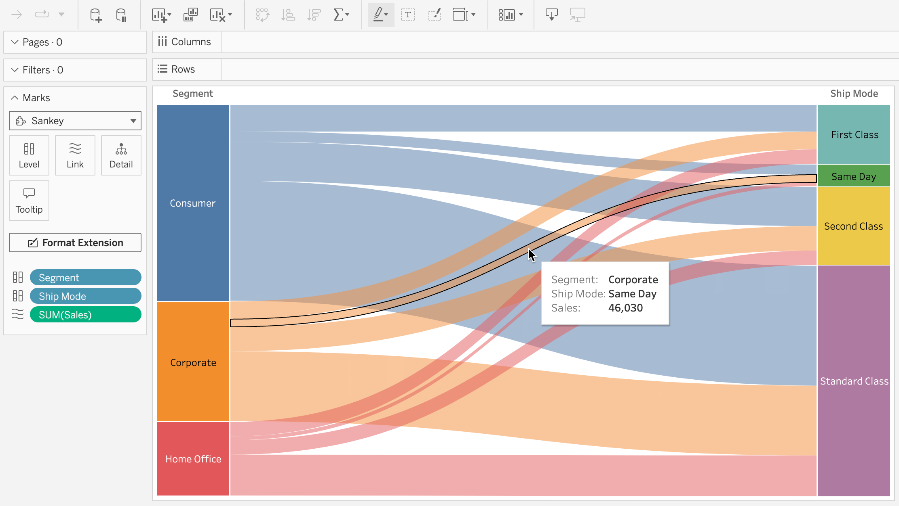

# Tableau Extensions API

## Why the Tableau Extensions API?

The Extensions API lets you do more without leaving Tableau. Build Tableau dashboard and viz extensions that can interact and communicate with Tableau, and embed them directly in your workbooks.

* Build viz extensions to create new viz types that Tableau users can access through the worksheet Marks card.

    

* Build dashboard extensions to add new features and functionality to Tableau that users can access through the dashboard.

    

## Setup and Running Samples

### Prerequisites

* You must have Node.js and npm installed. You can get these from [https://nodejs.org](https://nodejs.org).

### Install Extensions API SDK Components and Start Server

1. Open a command prompt window to the location where you cloned this repo.

2. Install the Extensions API SDK components.

    **npm install**

3. Build the TypeScript samples and install the Extensions API types library.

   **npm run build**

4. Start the local Dashboard Extension server.

   **npm start**

5. Launch Tableau and try a dashboard sample extension in a dashboard, or a viz extension in a worksheet. The dashboard and viz extension samples are located in the `Samples` folder.

 >**Note** The local web server you start just serves to host the extension samples and tutorial. These extensions have URLs similar to the following: `http://localhost:8765/Samples/Dashboard/DataSources/datasources.html`.
 >   This local web server is not intended to serve the Extensions API Help pages.
 >   View the Help on GitHub at [https://tableau.github.io/extensions-api](https://tableau.github.io/extensions-api).

### Typescript Development

Samples written in Typescript are located in the `Samples-Typescript` folder.
If you want to use TypeScript to write your extensions, you can run a script that starts up the HTTP server and actively listens for changes to the `.ts` files located in the `Samples-Typescript` folder. You can then add your extension to the folder and use the script to transpile your extension to JavaScript.

* To start the the HTTP server and listen for changes to the `.ts` files.

    **npm run dev**

* To automatically build the TypeScript samples whenever code change.

   **npm run build-watch**

For more information, see [Use TypeScript with the Extensions API](https://tableau.github.io/extensions-api/docs/core/trex_typescript).

#### Typescript Development in PdfViewer Sample

* To run tests for the PdfViewer sample.

    **npm run test**

* To automatically run tests for the PdfViewer sample whenever code changes.

    **npm run test-watch**

* To run test code coverage for the PdfViewer sample.

    **npm run test-coverage**

### Sandboxed Extension Development Environment

Tableau is introducing development support for Sandboxed Extensions with Tableau 2019.3. Sandboxed Extensions run in a virtual sandbox and ensure the extension can’t make network calls outside of the hosting Tableau Server. The Extensions API SDK provides a local development environment that replicates the Tableau Hosting Cloud Service for Sandboxed Extensions. You can test your Sandboxed extensions locally with the same sandbox policies.

1. Start the local Sandboxed Extension web server.

    **npm run start-sandbox**

2. Launch Tableau (Tableau 2019.3 and later) and try the sample Sandboxed dashboard extension in a dashboard. You can find the `.trex` file and sample code in the `Samples\Dashboard\UINamespace-sandboxed` folder.

For more information, see [Create and Test Sandboxed Extensions](https://tableau.github.io/extensions-api/docs/security/trex_sandbox_test).

## Contributions

Contributions and improvements by the community are welcomed!
See the LICENSE file for current open-source licensing and use information.

Before we can accept pull requests from contributors, we require a signed [Contributor License Agreement (CLA)](https://tableau.github.io/contributing.html). To submit a contribution, please fork the repository then submit a pull request to the `main` branch.

## Code Style
Our sample code follows the [Semi-Standard Style](https://github.com/Flet/semistandard) for JavaScript samples linting and [tslint](https://palantir.github.io/tslint/) for TypeScript.  If you add your own extension code to the Samples or Samples-Typescript directories, you can run `npm run lint` to validate the style of your code. Please run this command before submitting any pull requests for Sample code.

`npx semistandard --fix` to fix linting issues which can be fixed automatically.

## Documentation
[Visit the project website and read the documentation here.](https://tableau.github.io/extensions-api/)

## Issues
Use [Issues](https://github.com/tableau/extensions-api/issues) to log any problems or bugs you encounter in the docs or sample code, or to discuss any proposed changes or additions. 
