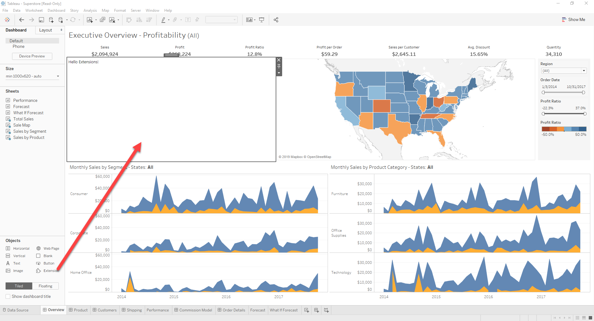

## Part 0 - Starting the Server & Registering a Manifest

This section contains a couple of very basic files which will become the basis of our extensions. There is a simple HTML page which includes jQuery and some other libraries, a javascript file where we will write our code, and an empty css file. At the end of the section, we'll be able to see our extension show up in Tableau, and load this basic html page inside a dashboard.

#### Starting the Server

Extensions are simply web pages, so the first thing we'll need to do is make sure we have a web server up and running to serve our content. To do that, navigate to the root of the extensions repository in a command prompt, and run `npm start`. This command will start a simple http server listening on port 8765 and just serving up the contents of this repository over http.

#### Testing It Out

The very first thing you need to do is to provide an extension, or manifest file (`.trex`). If you cloned or downloaded the `.zip` file for this repository, you can find the manifests for the tutorial inside the Manifests folder. The `.trex` file contains basic information like the name of the extension (as it will appear in Tableau) and the url where the extension is hosted. 

To open an extension, start Tableau and open a workbook that has a dashboard, or open a workbook and create a new dashboard. In the dashboard, under **Objects**, select **Extension** and drag it on to the dashboard. In the **Choose an Extension** dialog box, click **My Extensions** and browse to the `\extensions-api\Tutorial\Manifests` folder. Select the `Tutorial_Part_0.trex` file. You should see "Hello Extensions" on your dashboard.

[Next Section (Part 1 - Initialization)](../Part_1/readme.md)