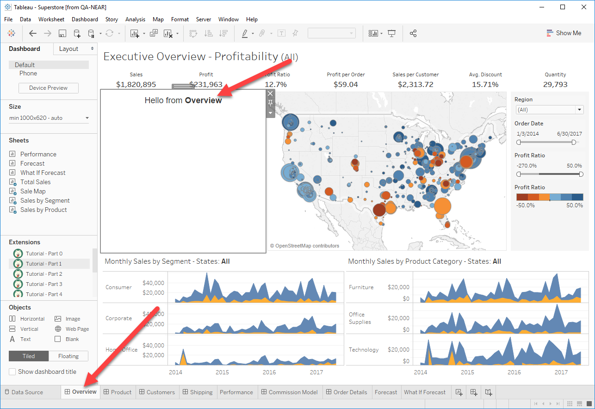

## Part 1 - Initialization

Now that we have our extension in our dashboard, we need to add some things to it in order to initialize communication with Tableau and get everything ready.

#### Adding the Tableau Extensions Library

A requirement of every extension is to include the Tableau Extensions JavaScript library. This library is reponsible for providing the API which your extension will communicate through. We include the library by adding a script tag to our html document with the path to the libary ``.

In Part 0, we included some external JavaScript libraries which will help make writing our extension easier. The JavaScript libraries we included were Bootstrap, DataTables, and JQuery. DataTables has a convenient download builder [here](https://datatables.net/download/) which we used to bundle all this together.

#### Telling Tableau we want to initialize

The final step for writing a complete extension is to call the Extension API method [`tableau.extensions.initializeAsync()`](https://tableau.github.io/extensions-api/docs/interfaces/extensions.html#initializeasync) when the page has loaded. This indicates to Tableau that this is a real extension and everything is working as expected. The method call also triggers Tableau to configure the rest of the Extensions API. A common pattern in the Extensions API is to have function names which end with `Async()`. When you see this in a function signature, it means that function will return a JavaScript [promise](https://scotch.io/tutorials/javascript-promises-for-dummies) which will resolve when complete.

#### Getting the dashboard's name

The final change we make is to add some code which will be executed once our initialize promise has resolved. This code grabs the name of the dashboard from [`tableau.extensions.dashboardContent.dashboard.name`](https://tableau.github.io/extensions-api/docs/interfaces/dashboard.html) and displays it to the user.

#### Trying it out

Drag out a new extension object and select the `.trex` file for Part 1. You should see the name of your dashboard in the zone.

[Next Section (Part 2 - Ask the User to Select a Sheet)](../Part_2/readme.md)