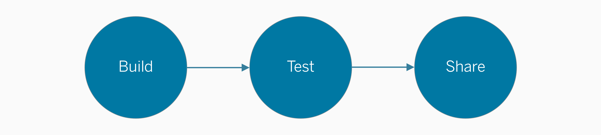

This section serves as a broad overview of the developer experience and considerations of making extensions. 

## Build
The first thing to do is start running sample extension code from the Extensions API Documentation. **Make sure that your sample code works** and your environment is set up properly before jumping into building a new extension. 

Once you're ready to go, you can start building and customizing your extension. Expect to iterate through cycles of developing and designing your extension using our API documentation and these design guidelines.

#### Get started with these resources:

* [Extensions API Documentation](https://tableau.github.io/extensions-api/) The Extensions API includes all the information you need to build an extension.

* [Community Forums](https://community.tableau.com/community/developers/extensions-api/overview) Participate in a community of developers that are passionate about creating extensions.

* [Tableau Exchange](https://exchange.tableau.com/) Explore and use some of the extensions our partners have created.

* [Developer Preview](https://prerelease.tableau.com/extensions-api) Participate in the Developer Preview for our Extensions API. Be invited to bi-weekly sprint demos with Tableau's development team and have the opportunity to give ongoing feedback.

## Test
Ensure that your extension works properly for different test cases. Try it on your own dashboards, test it with others, and uncover possible edge cases. 

Consider that dashboard extensions can be both **configured** and **viewed** in Tableau. These terms refer to two usage modes we recommend for extensions. To read about these modes and their audiences, learn more at **[Extension Components and Modes]({{ site.baseurl }}/docs/Interaction_Guidelines/ux_components_modes.html)**.

## Share
After you've completed making your extension, you may want to share your extension for others to use. Here are some places you might think about sharing your extension.

### Tableau Exchange
Tableau has released the [Tableau Exchange](https://exchange.tableau.com/) (formerly, Tableau Extension Gallery), a place to explore and download some extensions that our partners have created. If you would like to share your extension, learn more at [Sharing to the Tableau Exchange]({{site.baseurl}}/docs/ux_extension_gallery.html).

### Community Forums
Tableau also has a [Community Forum](https://community.tableau.com/s/) for developers to discuss extensions and the Extensions API.

-----

While you might not choose to share your extension directly with Tableau, we encourage you to share your extension through other platforms of your choice! Use it internally at your company or for yourself, consider open source platforms, share over social media channels. How you go about sharing your extension with the world is entirely up to you.
