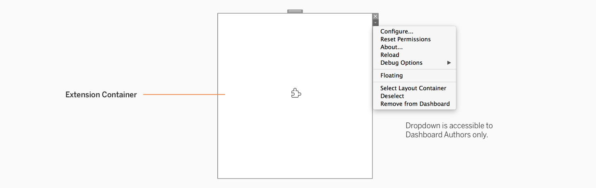
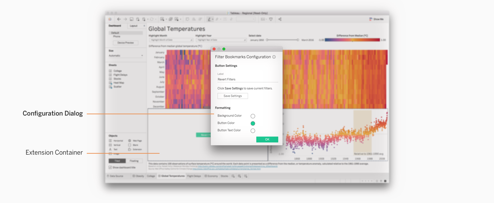
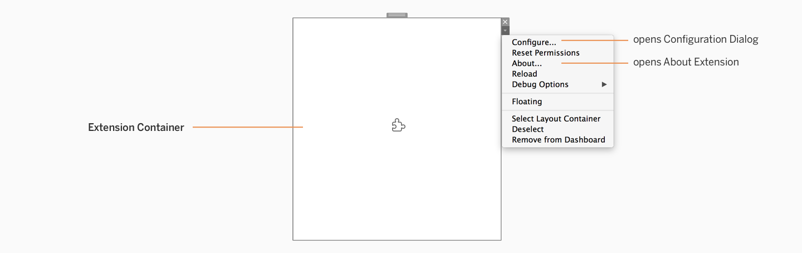
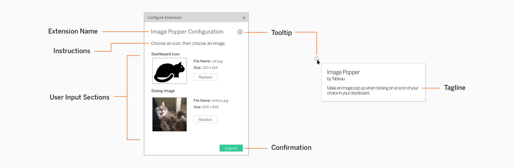
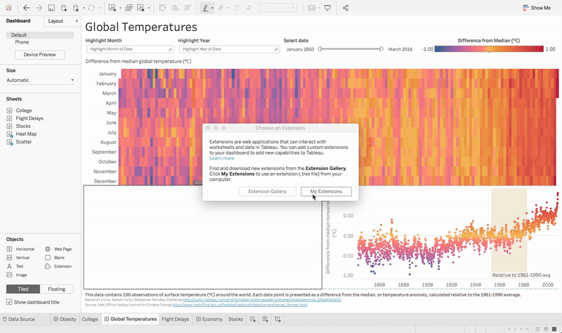
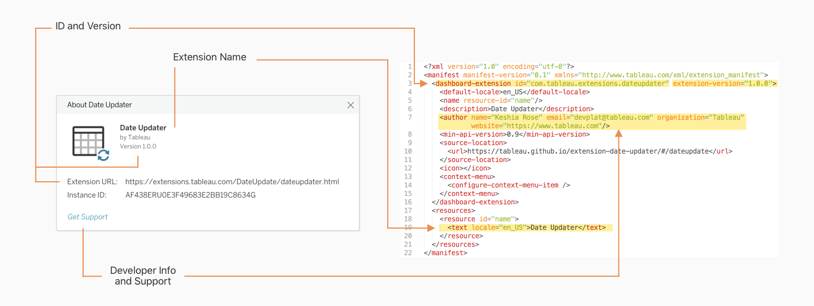

This section outlines the overall experience of using an extension in a dashboard. 

**In this section**

* TOC
{:toc}

<!---
#### Foundation
Every dashboard extension has two general user experiences and three main components. 

* [User Types](#user-types)
* [Extension Container](#extension-container)
* [Configuration Dialog](#configuration-dialog)
* [About Extension Dialog](#about-extension-dialog)

#### Modes
After acquainting yourself with the user types and components, read about use modes for extensions.

* [Configuration Mode](#configuration-mode)
* [Viewing Mode](#viewing-mode)

-->
&nbsp;

---
# Foundation
Every dashboard extension has two general user experiences (or *user types*) and three main components. 

## User Types
Extensions must be designed with two types of dashboard users in mind: authors and viewers (consumers). 

#### Dashboard Author
Dashboard Authors are users that create dashboards and work directly with data in Tableau, both on Desktop and Online authoring modes. Authors get full editing capability over an extension’s configuration settings. 

On dashboards, authors primarily use **[Configuration Mode](#configuration-mode)** and can access **[Viewing Mode](#viewing-mode)**.
  
#### Dashboard Viewer
Dashboard Viewers are users that can only use dashboards with extensions on Tableau Online. Viewers usually don't set up a workbook or extension themselves, so they don’t have editing capability over an extension’s configuration settings.

On dashboards, viewers interact with extensions only in **[Viewing Mode](#viewing-mode)**. 

&nbsp;

&nbsp;

## Extension Container
The extension container lives in a dashboard, and is the primary place to display content for both dashboard authors and viewers. For example, this area could be used for displaying a custom visualization or user input controls to further customize dashboard data. 

This is where authors can access the dropdown menu for more options, such as configuration and information about the extension.

<i>Learn more about branding your extension container at [Branding your Extension]({{site.baseurl}}/docs/Style_Guidelines/ux_branding.html#extension-container).<i>

&nbsp;

&nbsp;

## Configuration Dialog
The configuration dialog is the primary way that dashboard authors can customize an extension in their dashboards. 

This dialog is only available to dashboard authors, It is primarily accessible through the dropdown menu present on the Extension Container. It is not visible to regular dashboard viewers. Learn more below at **[Configuration Mode](#configuration-mode)**.

<i>Learn more about branding your configuration dialog at [Branding your Extension]({{site.baseurl}}/docs/Style_Guidelines/ux_branding.html#configuration-dialog).
</i>
&nbsp;

&nbsp;

## About Extension Dialog
The about extension dialog exists for dashboard authors to access support and version information about the extension in the dashboard. Currently, this dialog is not available for regular dashboard viewers on Tableau Online. Learn more below at **[Configuration Mode](#configuration-mode)**

&nbsp;

&nbsp;

&nbsp;

# Modes
After acquainting yourself with the user types and components, read about use modes for extensions.

&nbsp;

## Configuration Mode
This mode is available only to dashboard authors. Here, we describe how configuration mode works across the extension components.

#### Extension Container
The extension container offers a high level of functionality for dashboard authors. This is where authors can access the extension menu to reach the configuration dialog and other information about the extension.

&nbsp;

#### Configuration Dialog
The configuration dialog allows dashboard authors to customize extensions in their dashboards. These are some general components that a configuration dialog should ideally include.

|     | Details |
| --- | ------- |
| **Extension Name** | The name of the extension is clearly displayed at the top of the configuration dialog in title case. |
| **Instructions** (optional) | Write 1-2 lines of simple instructions for a user to successfully set up the extension. |
| **User Input Sections** | This is the main zone where user input fields and controls live. You can create multiple sections to separate content from each other. Ensure that sections are clearly titled and spaced apart from each other. |
| **Help Tag** | This dialog is activated by hovering one's cursor over the icon, and helps the user learn more about the extension.|
| **Tagline**  | The tagline is one sentence in the help tag that explains what the extension does. The maximum character limit is 96 characters.|
| **Confirmation** | Make sure there is a clear way for users to apply changes made while configuring the extension. |

<i>Learn more about [Controls and UI Patterns]({{site.baseurl}}/docs/Interaction_Guidelines/ux_controls_ui_patterns.html) to use in your configuration dialog.</i>

&nbsp;

##### Automatic Configuration Popup
Many extensions require an author to configure the extension before using it in the dashboard. The configuration dialog is accessible through the extension dropdown menu, but to speed up the process, you can skip directly to the configuration dialog. You can set a configuration dialog to pop up automatically after an author adds your extension into their dashboard. 

While this is optional, **we strongly recommend using this popup pattern** because when an author is configuring the extension for the first time, there often isn't any content present in the extension container until the extension has been configured. Using this popup pattern will allow authors to start configuring the extension right away.

<i>Learn more about how to implement this popup at [Add a Configuration Popup Dialog (Extensions API Documentation)](https://tableau.github.io/extensions-api/docs/trex_configure.html).</i>

&nbsp;

#### About Extension Dialog
The About Extension Dialog is automatically created using the content from your .trex manifest, which includes items such as your extension’s name, developer info, support, source ID, version info, etc. This is also accessible through the dropdown menu in the extension container.

<i>Learn more about the manifest file at [Tableau Extension Manifest File (Extensions API Documentation)](https://tableau.github.io/extensions-api/docs/trex_manifest.html).</i>

    
&nbsp;

&nbsp;

&nbsp;

## Viewing Mode
This mode is available to both dashboard authors and viewers. 

* **Authors** have access to configuration mode and viewing mode in both Tableau Desktop and Online.
* **Viewers** only have access to viewing mode on Tableau Online. Viewers can't access configuration and about dialogs, but can use an extension as it appears in a dashboard on Tableau Online.

#### Extension Container
Viewers can only interact with dashboard extensions in Tableau Online. When viewing, there are no settings around containers or zones that viewers can access. The extension container appears just as other containers in the dashboard.

However, if viewers have permission to edit the workbook on Tableau Online or download the workbook to their local machine, they can access all of the same settings described above in **[Configuration Mode](#configuration-mode)**. 

&nbsp;

&nbsp;

---
<!-- 

### 

[ 3 – Controls and UI Patterns &#8594;](3 - Controls and UI Patterns.md)

##### 

[&#8592; 1 – Build, Use, Share](1 - Build, Use, Share.md)

-->