Controls and UI patterns help users interact with your extension and customize their experience. 

We've provided examples of controls that are used in Tableau. Using the exact styling of these components is optional.

* [Activity Indicators](#activity-indicators)
* [Buttons](#buttons)
* [Dialogs](#dialogs)
* [Dropdowns](#dropdowns)
* [Selectors](#selectors)
* [Text Fields](#text-fields)
* [Tooltips](#tooltips)

The controls described here use Tableau branding, accessible from the **[Color](Style Guidelines/6 - Color.md)** and **[Fonts](Style Guidelines/7 - Fonts.md)** sections of these design guidelines.

###### *At this time, we are only able to provide surface-level usage and design specifications for controls. We are working to make code for Tableau controls accessible to developers in the future.*

---

&nbsp;

## Activity Indicators 
When performing an action, let users know that your extension is currently doing something and isn’t static or stalled. Make sure your extension acknowledges the user’s interactions by providing some form of tangible feedback.

An activity indicator appears when a task is performed that will take an unknown amount of time, such as loading or synchronizing complex data. It disappears when the task is complete.

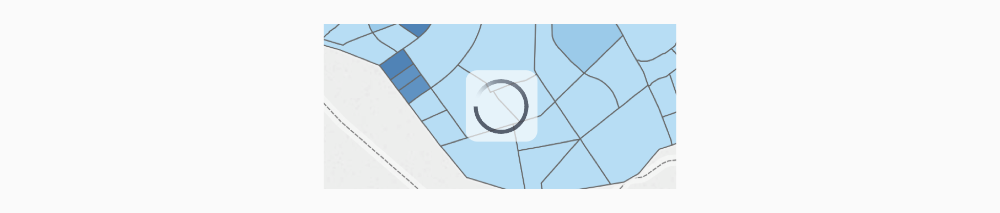

### Usage
These activity spinners used in Tableau run at one rotation per second, and are non-interactive. 

Using this exact spinner in your extension is optional. For alternate options, we recommend using activity indicators of similar sizes and variety to ensure that it works on varying background elements.

| Variations | Preview | SVG Code | How to use |
|---------------------|:---------:|:---:|---|
| **Large** (50x50 px) |  | [SVG](xml/large.xml) | Use only on light backgrounds   |
| **Large with underlay** (65x65 px) | 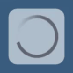 | [SVG](xml/large-with-underlay.xml) | Use on light or complex backgrounds to provide better contrast |
| **Large on dark background** (50x50 px) |  | [SVG](xml/large-on-dark-background.xml) | Use only on dark backgrounds |
| **Small on dark background** (14x14 px) |  | [SVG](xml/small-on-dark-background.xml) | Use only on small elements with dark backgrounds |
| **Small** (14x14 px) | 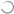 | [SVG](xml/small.xml) | Use only on small elements with light backgrounds

&nbsp;

&nbsp;

&nbsp;

---

## Buttons
A button communicates what happens when a user touches it. Button labels can consist of text, an icon, or a combination of both.

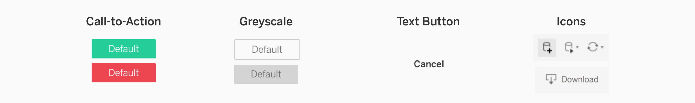

### Usage

| Button | How to use |
|----|:-----|
| **Call-to-Action  &nbsp; &nbsp; &nbsp; &nbsp; &nbsp; &nbsp; &nbsp; &nbsp; &nbsp; &nbsp; &nbsp; &nbsp; &nbsp; &nbsp; &nbsp; &nbsp; &nbsp; &nbsp; &nbsp; &nbsp; &nbsp; &nbsp; &nbsp; &nbsp;**  | These buttons are primarily used in dialogues to indicate an action. Use colors to communicate function–for example, green is commonly used for confirmation buttons. Learn more about color usage at **[Colors](Style Guidelines/6 - Color.md)**.  You may also want to utilize branding practices on buttons. Learn more at **[Branding your Extension](Style Guidelines/4 - Branding your Extension.md)**. |
| **Greyscale** | Greyscale buttons are used either to indicate a secondary action, or a button that has been disabled and a particular action needs to be taken before proceeding. |
| **Text Button &nbsp; &nbsp; &nbsp; &nbsp; &nbsp; &nbsp;** | This is a low-attention button, and should only be used to provide a secondary option in the case that the user wants to perform an action that isn’t the primary action. |
| **Icon** | Buttons can have icons to add a helpful visual. If you use icons, include a text label or a help tag that is activated on hover. |

&nbsp;

**Button Placement**

Button placement guidelines apply to Call-to-Action and Greyscale buttons.

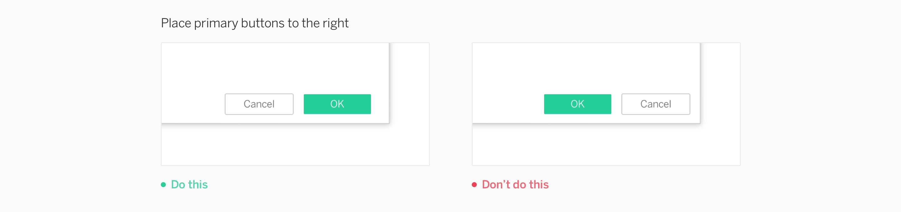

&nbsp;

**One Primary Button**

Primary buttons apply only to Call-to-Action buttons.

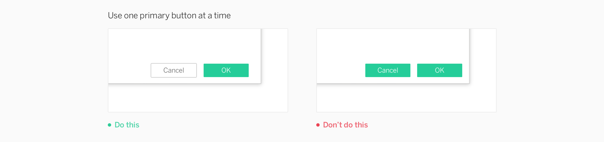

&nbsp;

&nbsp;

### Specifications

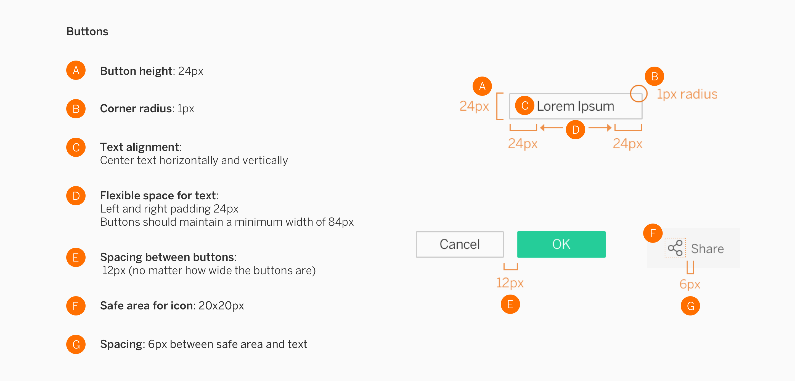

&nbsp;

&nbsp;

&nbsp;

---

## Dialogs

A dialog is a “conversation” between the system and the user, which often requests information or action from the user. For info about the extension configuration dialog, learn more at **[Extension Components and Modes](2 - Extension Components and Modes.md)**. 

### Standard Dialog
These dialogs are non-modal, meaning they can be used when the requested information is not essential to continue. The dialog can be left open while the user interacts with other components in the extension. 

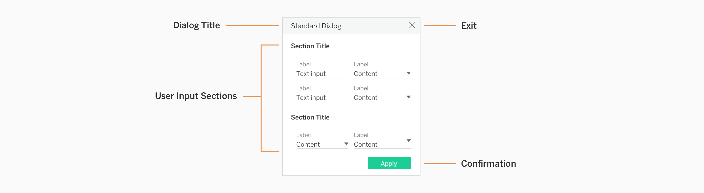

&nbsp;

### Tab Dialogs
If you’d like to have multiple sections to your dialogs, you may use tabs to separate content. 

#### Top Tabs
Top tabs allow a dialog to contain several pages of content in one place. Use this variation to have 3 distinct sections of content. Do not exceed 3 top tabs.

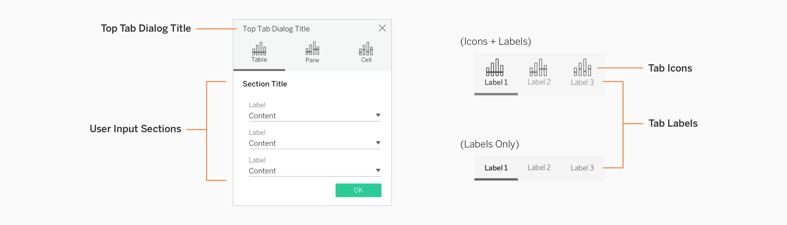

&nbsp;

#### Side Tabs
If you need more tabs in a dialog than the top tab system can accommodate, it is appropriate to utilize the side tab style of navigation. Use this tab variation if you need 3 or more sections of content. Do not exceed 5 side tabs. 

&nbsp;

&nbsp;

### Specifications
Dialog content can vary widely, but consists of specific textual or UI elements that should meet some of the following standards.

##### Standard Dialog

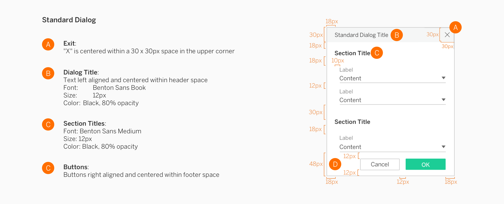

&nbsp;

##### Top Tab Dialog

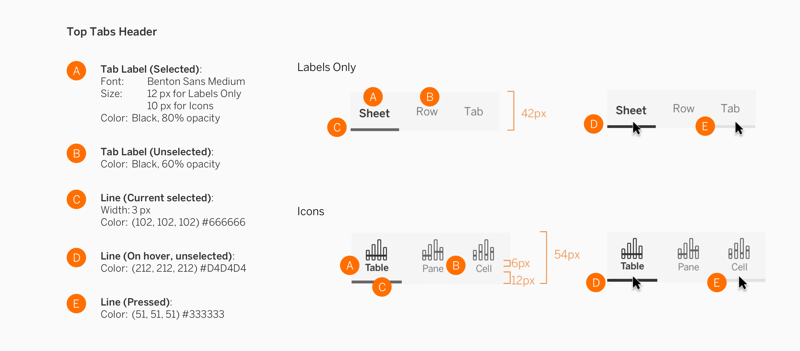

&nbsp;

##### Side Tab Dialog

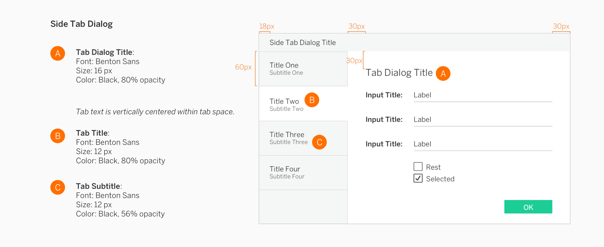

&nbsp;

##### Dialog Widths
Dialog height will vary based on content but width will fit into one of these standard sizes. 

&nbsp;

&nbsp;

&nbsp;

---

## Dropdowns

Dropdown controls allow multiple options to be expanded from a menu. Dropdowns have two main components: **Control and Menu**. 

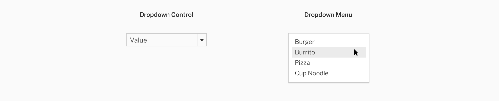

&nbsp;

### Usage

|  | How to use |
| --- | --- |
| **Controls &nbsp; &nbsp; &nbsp; &nbsp; &nbsp; &nbsp;** | Dropdown controls have an arrow on the right side, which indicates the control is actionable. This button is primarily used in dialogues to indicate an action.  |
| **Menu** | A dropdown menu contains a group of selections. When a menu item is selected, the dropdown control is updated to reflect the user's new choice. |

&nbsp;

##### Control Variations

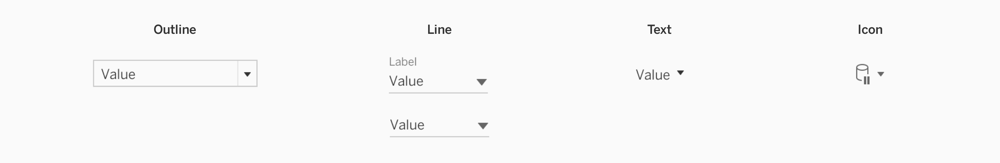

|  | How to use |
| --- | --- |
| **Outline** | The outline style is the primary variation that should be used. It can be used by itself, on forms, or within dialogues.  |
| **Line** (label optional) &nbsp; &nbsp; &nbsp; &nbsp; &nbsp; &nbsp; &nbsp; &nbsp; | Line style dropdowns are useful in areas that have cramped vertical space. This dropdown style can be stacked within panels to avoid a boxy wireframe feel. While the label is optional, we encourage using it to better inform users about the category of items. |
| **Text** | This style allows the user to access options from a dropdown or flyout menu. This style works well in tool and start bars, as well as in dialogs and menus. |
| **Icon** | The icon style works best in small regions such as tool bars, and is great for switches that have several options. |

&nbsp;

##### Menu Variations

|  | How to use |
| --- | --- |
| **Standard** | This is the primary dropdown menu style. If your dropdown menu has many items or needs more classification, consider implementing some of the other options pictured. |
| **Nested Flyout** | If your menu needs more broad categories to choose specific items from, it can have a nested flyout menu. |
| **Search** | Search can be added to dropdown menus. Use this variation if your menu may have many items in the list to allow users to easily search for a specific item.  |
| **Checkbox** | Checkboxes can be used for multi-select dropdowns. |
| **Compound** | Compound menus allow for items to be grouped by separate types. |

&nbsp;

##### Stacking Dropdowns

Use the line style when stacking several dropdowns on top of each other to avoid a boxy wireframe look and feel. 

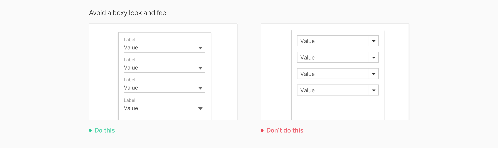

##### Dropdown Menus

There is no space between the control and the menu. The minimum menu width is 40px, and the maximum is 260px. Menus can be wider than the control, but should not be narrower.

&nbsp;

&nbsp;

### Specifications
Design specifications are grouped by the type of control and their corresponding control states, then menu variations. 

##### Controls

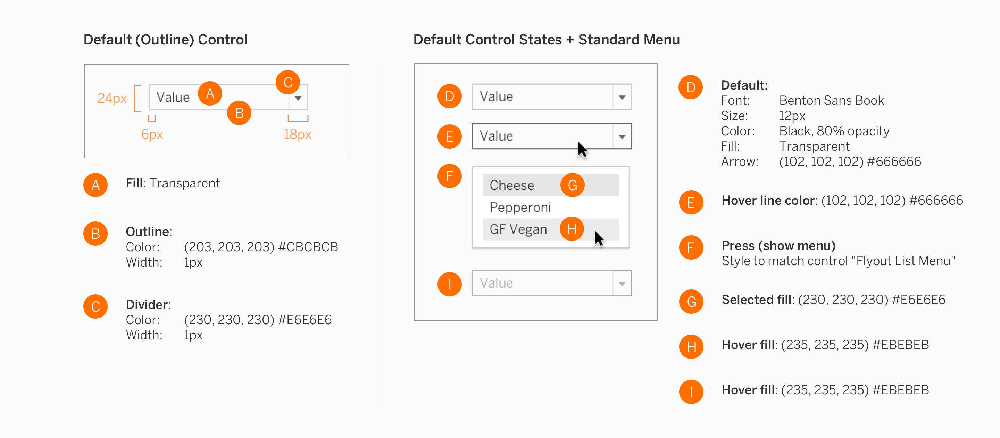

##### Menus

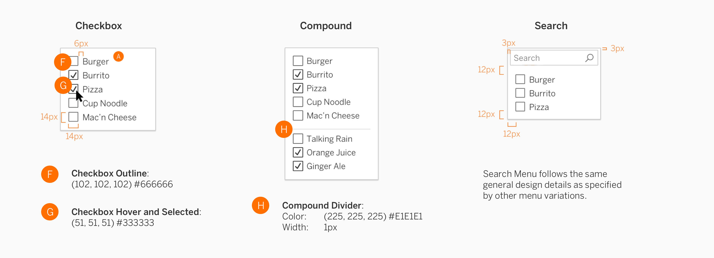

&nbsp;

&nbsp;

&nbsp;

---

## Selectors
Selectors are a broad family of controls within the interface. This family has been broken down into four categories: **Pickers, Sliders, Steppers, and Toggles**.

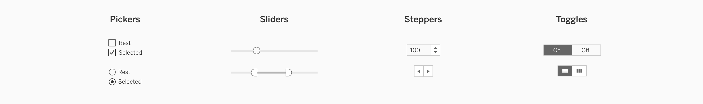

&nbsp;

### Usage

|     | How to use    |
| --- | --- | 
| **Pickers** | Pickers enable users to make a selection from a list of options. Each picker has an icon control such as a checkbox or radio button. |
| **Sliders** | Sliders enable users to adjust totals without inputs via the keyboard. They are a convenient choice for selecting a value when there are known maximum and minimum values. |
| **Steppers** | Steppers enable users to click or tap on a control to change values. They often have a text input allowing the user to choose between keyboard input and mouse/tap input. |
| **Toggles** | Toggles are the simplest picker. They enable users to choose one item, while one or more items are off.  |

&nbsp;

### Specifications

##### Pickers

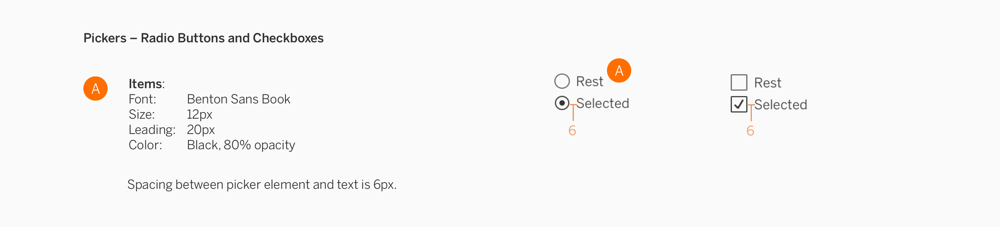

##### Sliders

##### Steppers

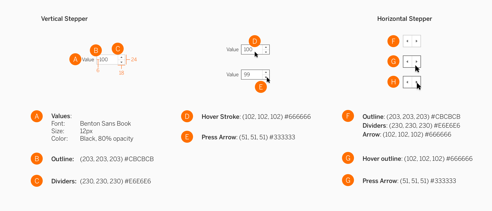

##### Toggles

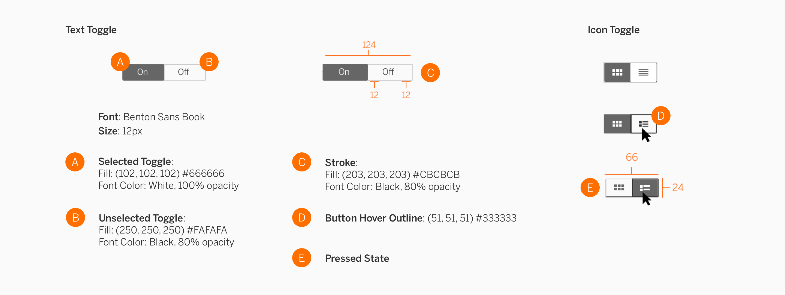

&nbsp;

&nbsp;

&nbsp;

---

## Text Fields
Text fields are places in the user interface where users enter text or phrases, such as on a form or sign in page.

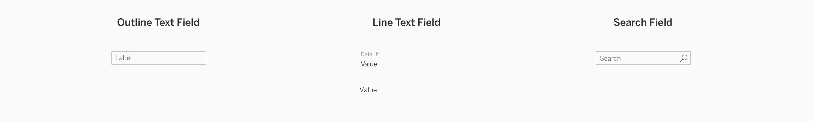

&nbsp;

### Usage

| &nbsp; &nbsp; &nbsp; &nbsp; &nbsp; &nbsp; &nbsp; &nbsp; &nbsp; &nbsp; &nbsp; &nbsp; &nbsp; &nbsp; &nbsp; &nbsp; &nbsp; &nbsp; &nbsp; &nbsp; &nbsp; &nbsp; | How to use    |
| --- | --- | 
| **Outline Text** | The outline style has a prominent appearance that can be used by itself, on forms, or within dialogues. |
| **Line Text** | The line text field can be used for stacking multiple fields within a panel to avoid a boxy wireframe feel. Line style text fields are useful in areas that have extremely limited vertical space.  |
| **Search** | Search boxes allow users to search for terms, and appear at the top of a page or dialog. |

&nbsp; 

##### Stacking Text Fields

Always use the line text field style in forms, or when fields are stacked.

&nbsp; 

### Specifications

##### Default

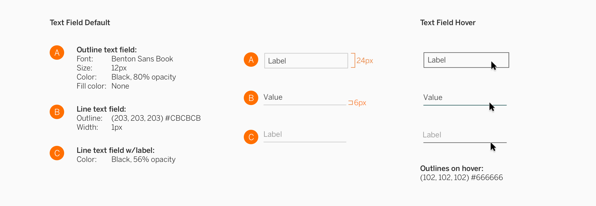

##### Search

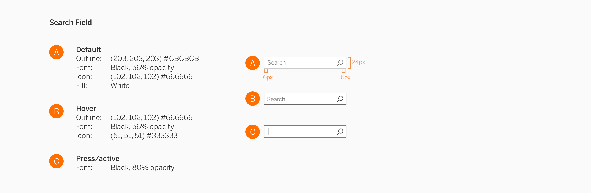

&nbsp;

&nbsp;

&nbsp;

---

## Tooltips
Ideally, your users should be able to figure out how to use your extension without needing a guide. But to help users understand more context to the task they’re performing, you may utilize tooltips.

In general, tooltips are general small boxes that contain information about the item. When the user places their cursor over an item without clicking it (hover), a tooltip may appear.

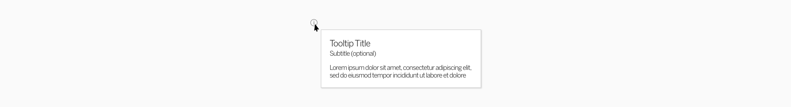

&nbsp;

### Usage
Descriptive tooltips are always anchored to the element with which they are associated. Tooltips can help further describe controls without shifting the user’s attention away from the primary interface. You may want to put tooltips in some parts of your extension if you want to briefly explain the use of a particular control or section. 

##### Placement

Tooltips should not cover other icons in the toolbar, or block related content.

##### Content

Include succinct copy that helps the user take their next step. 

&nbsp;

### Specifications

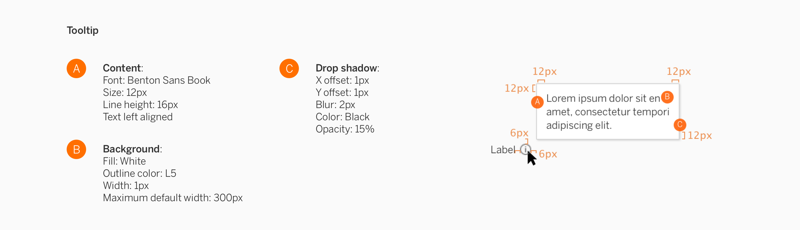

&nbsp;

&nbsp;

&nbsp;

---

<!-- 
### 

[Style Guidelines &#8594; ](Style Guidelines)

##### 

[&#8592; 2 – Extension Components and Modes](2 - Extension Components and Modes.md)

-->
