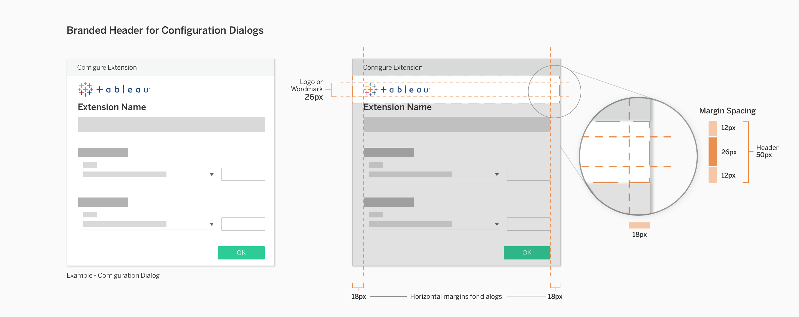
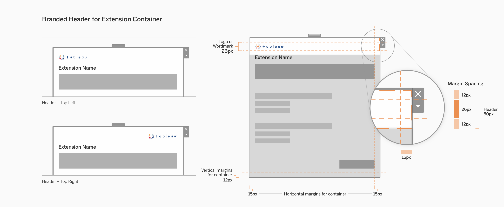
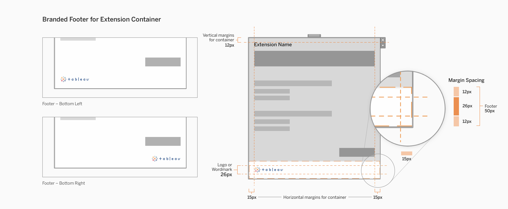
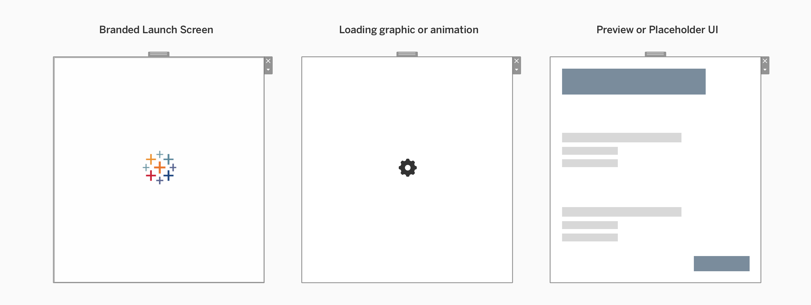

Whether you’re a developer from one of our partners or an independent developer, you may want to brand your extension to visually distinguish it as your extension. You also have the option of styling your extension to look native to Tableau. 

* [Branding Principles](#branding-principles)
* [Styling Options](#styling-options)
* [Configuration Dialog](#configuration-dialog)
* [Extension Container](#extension-container)
* [Media and External Links](#media-and-external-links)

## Branding Principles

There are two fundamental principles to consider when branding your extension.

**Celebrate content** 
 Your extension is designed to give users eye room to focus and plenty of negative space to help quickly parse the tools. Colors and tones don’t stress the eye. The UI is muted, and takes a back seat, allowing the content to be the hero.

**Focus on functionality** 
Fun and delightful, but never at the expense of functionality or utility. Enough focus to find what you need, but not so much that it visually interferes with your content. Everything has a visual purpose.

Proper extension branding means that brand elements are subtle enough to let the function and content of the extension shine, but are also present enough to be noticed and recognized. Function and content come first, brand comes second. 

&nbsp;

## Styling Options
You have the option of using Tableau's visual styling or your personal/company branding on your extension. 

**You might style your extension like Tableau if...**

* You want your extension to match the visual style of Tableau’s workbooks, making it feel like it fits naturally into Tableau.
* You don’t have a style guide to work with currently, and want to use a generic one for extensions.

**You might style your extension with personal or company branding if...**

* You want more visibility, exposure, or recognition for your personal/company work.
* You have an existing style to work with.

Either option offers flexibility in the styling and content of your extension. In the end, it's up to you to decide the best direction for your extension.

&nbsp;

## Placement
Your extension can be branded through two components: the **configuration dialog** and the **extension container**. Here's how to place brand elements in each of these areas. 

<i>Links to review component usage and controls specifications</i>:

* **[Extension Components and Modes](Interaction Guidelines/2 - Extension Components and Modes.md)**
* **[Controls and UI Patterns](Interaction Guidelines/3 - Controls and UI Patterns.md)**

&nbsp;

### Configuration Dialog
Configuration dialogs act as the main point of brand communication with dashboard authors.

&nbsp;

#### Headers
One place to put brand elements in a configuration dialog is the header region. Upon opening configuration, dashboard authors will naturally view the top of the dialog. 

The recommended height for the branded header is **50px** with vertical margins of **12px** and horizontal margins of **18px**. In this brand header, a logo/wordmark is **26px**. Because the header is also where the extension name is displayed, headers are limited in size as to not distract from the main content of the extension dialog. This is the preferred header styling for configuration dialogs.

If your extension's configuration dialog is large and includes more content and controls, your brand elements may benefit from being larger. This header styling should only be used if the configuration dialog is **larger than 375px in height**. 

&nbsp;

#### Footers
Another place to put brand elements in a configuration dialog is the footer region. The footer is less obtrusive than a header, allowing your extension content to come first and foremost. Sizing for the branded footer is more flexible than the branded header because it comes after the main extension content. 

**If you have brand elements that must be displayed at larger than 40px in height, it is preferable to use a branded footer.** The branded footer can accomodate variable heights of elements, small or large. However, still ensure that the branded footer elements do not visually overwhelm the main extension content that lives above it. 

&nbsp;

&nbsp;

### Extension Container
Extension containers are visible to both dashboard authors and viewers. **We recommend that extensions in the dashboard should align with Tableau’s visual style** to allow extensions to feel like they naturally belong in Tableau dashboards and worksheets. For example, controls should be styled to look like Tableau's controls. 

However, there are still small opportunities to increase visiblity of your company and brand. Here are some guidelines for including brand elements in your extension container.

&nbsp;

#### Corners
Space is limited in extension containers because the content should be mainly focused on the extension. The suggested brand elements to use in extension containers are brand colors and small logos/wordmarks. 

Brand elements must be minimal and limited to the corners of headers and footers. We recommend placing logos in the corners of the container because this placement will allow for a brand presence to be noticed, but is still separate enough from the content. 

The max height of header and footer zones should be **50px or less**. Content in the extension container should maintain a minimum of **12px** from the tops and bottoms (vertical margins), and **15px** from the left and right sides (horizontal margins). 

&nbsp; 

#### Empty Container State
While a user is initially configuring the extension, the extension container doesn’t have anything in it yet. Rather than simply showing it as empty or blank, you may use this opportunity to provide feedback to the user that the system is doing its job. Feedback in this context can help users understand what the extension is currently doing. 

Here are some examples of things you can do with this empty space.

| | Description |
| --- | --- |
| **Branded launch screen** &nbsp; &nbsp; &nbsp; &nbsp; | Much like a static splash screen that simply presents your company/personal branding logos/etc. |
| **Loading graphic or animation** | Use to give the appearance of preparing content in the background as the user configures your extension. This could also be a graphic or animation based on your existing branding. |
| **Preview or placeholder UI** | Using neutral and basic visual styling, you can show a preview of where elements will show up once the extension is done being configured.  |

&nbsp; 

&nbsp;

## Media and External Links
Headers and footers in configuration dialogs and extension containers can contain media and external links, but it is recommended that you use a **branded footer** as the primary place to put these elements. 

Headers must be restricted in size to prioritize the extension content below it, so footers usually offer the most flexibility in adding additional brand elements other than a logo or wordmark. 

Here are some items you might choose to include:

- Link to company or developer website
- Link to extension support/documentation
- Common social media icons

Any external links must open in the user's OS browser, not within Tableau's extension container or dialogs.

&nbsp; 

&nbsp;

---
<!-- 
### 

[5 – Layout &#8594; ](5 - Layout.md)

##### 

[Style Guidelines](Style Guidelines)

-->