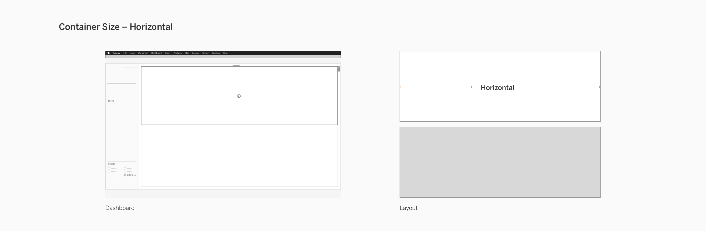

To encourage consistency across the design of extensions, we’ve outlined some important aspects about dashboard containers and spacing of elements for your **extension container**. 

## Dashboard Containers
When designing an extension container's contents and controls, consider the common sizes of containers in a dashboard. Containers and objects are added to the dashboard via drag-and-drop. Containers can be manually resized and made to be floating. You will have to ensure that the content of your extension container will resize and display properly. It is recommended to use common responsive web design practices, such as use of breakpoints and percent-based widths.

Generally, dashboard containers will automatically size to one of these formats:

### Horizontal Span

Your extension content should consider how it would display properly when the container spans wide or horizontally.

&nbsp;

### Vertical Span

Your extension content should also consider how it would display properly when the container spans tall or vertically. 

&nbsp;

### Quadrant/Section

It is common for extensions to take up a smaller size due to most of the functionality taking place in the configuration dialog rather than the extension container. Your extension should properly resize to accomodate for smaller areas like quadrants and sections. 

&nbsp;

&nbsp;

## Spacing

Specifications about spacing have been detailed in **[Controls and UI Patterns](../Interaction_Guidelines/ux_controls_ui_patterns)** and **[Branding your Extension](ux_branding)**.

Here are some links to specific parts of your extension that you may need spacing guidance on:

* [**Dialogs** (Controls and UI Patterns)](../Interaction_Guidelines/ux_controls_ui_patterns#dialogs)
* [**Configuration Dialog** (Branding your Extension)](../Style_Guidelines/ux_branding#configuration-dialog)
* [**Extension Container** (Branding your Extension)](../Style_Guidelines/ux_branding#extension-container)
