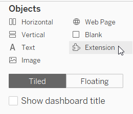
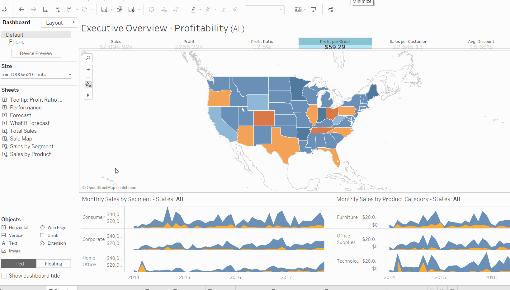

The Tableau Dashboard Extensions API allows developers to create extensions for Tableau. Tableau extensions are web applications that can interact and communicate with Tableau. A dashboard extension can be placed in the dashboard like any other dashboard object.

This section will take you through the process of setting up your environment to use one of the sample dashboard extensions. Using one of the sample extensions is a great way to learn and great way to get started developing your own extensions. In this section, you will start a simple web server on your computer to host the sample. You can use the same process for hosting the extension when you start developing your own.

:::note

If you are looking for information about how to add an extension to a dashboard in Tableau, see [Use Dashboard Extensions](https://onlinehelp.tableau.com/current/pro/desktop/en-us/dashboard_extensions.htm). If you are looking for extensions that you can use, see the [Tableau Exchange](https://exchange.tableau.com/).

:::

----

:::info

**What's in a Tableau extension?**
A Tableau extension consists of a manifest file (`.trex`), a web page that uses a Tableau-provided JavaScript library, and the JavaScript file (or files) that contain your extension logic. The Tableau extensions are supported on Tableau Desktop, Tableau Server, and Tableau Cloud.

:::

----

### What you need to get started

If you want to create an extension or work with the sample code, make sure you have followed the instructions for [installation](../installation).

----

### Start a web server to host the sample dashboard extensions

To use the dashboard extension samples, you need to start up a web server on your computer to host the HTML pages. If you downloaded or cloned the Extensions API repository, you can start the web service in the root directory of the repository on your computer. For example, if you downloaded the `extensions-api-main.zip` file to your `Downloads` directory, after you extract the files, the directory would be `extensions-api-main`. If you cloned the repository, the directory would be `extensions-api`.

1. Navigate to the `extensions-api-main` or `extensions-api` directory.

1. Navigate to the `extensions-api` directory.

2. To install the web server components, run the following npm commands to install the package:


   **npm run build**

  
3. To start the web server, run the following npm command:
 
   **npm start**

    The start command runs a script to start the web server over port `8765`. You only need to install the web server components the first time. Subsequently, you can just start the web server, using **npm start**.
    The start commands uses the npm [http-server](https://www.npmjs.com/package/http-server) package, a simple HTTP server that uses Node.js for serving static files to the browser.


    | **Note:**  The web server just serves the extension samples, which have URLs similar to the following: `http://localhost:8765/Samples/DataSources/datasources.html` This local web server is not intended to serve the Extensions API Help pages. View the Help on GitHub at [https://tableau.github.io/extensions-api](https://tableau.github.io/extensions-api).

----

### Start Tableau and add an extension to the dashboard

1. Start Tableau and open a workbook that has a dashboard, or open a workbook and create a new dashboard. For example, you could use one of the Tableau sample workbooks like Superstore to start with.

2. In the dashboard, under **Objects**, select **Extension** and drag it on to the dashboard.

   

3. In the **Add an Extension** dialog box, click **Access Local Extensions**.
   Every Tableau extension has a manifest file (`.trex`) that describes the extension and identifies the location of the web application.

4. Browse to the directory where the samples are located. For example, if you downloaded or cloned the GitHub repository, go to `\extensions-api\Samples\DataSources`.

5. Open the `DataSources.trex` file.
   The sample extension (web application) appears in the dashboard frame. The DataSources sample finds and displays the data source for each worksheet in the dashboard.

6. In the DataSources extension, click the **Info** (**i**) button.  This action opens a dialog box that displays more details about the selected data source.  

   

----

### Examine the source code for the extension

Looking at the files that make up an extension will give you an idea of how an extension is constructed.

1. Browse to the directory where the DataSources sample is located. For example, if you downloaded or cloned the GitHub repository, go to `\extensions-api\Samples\DataSources`.

2. Open the `datasources.html` file in your favorite Text or Code editor. This HTML page provides the interface that users see when they load the extension. This file includes links to the Extensions API library file and to the file that contains all the JavaScript code for the extension.

    ```html
    <!-- Extensions Library  -->
    <script src="../../lib/tableau.extensions.1.latest.js"></script>

    <!-- Our extension's code -->
    <script src="./datasources.js"></script>
    ```

3. Open the `datasources.js` file. This file contains code to initialize the Extensions API, and contains functions to gather all the data sources used by the workbooks in the dashboard. Read through the code and the code comments to get an understanding about how this extension works. The Extensions API makes use of JavaScript Promises to collect the data returned from the asynchronous function calls. Look for the code that initializes the extension. An extension will often place the initialization code in the JQuery `$(document).ready()` function so that it will run when the page is loaded.

    ```javascript
    (function () {
      $(document).ready(function () {
        tableau.extensions.initializeAsync().then(function () {
        /* body of function  */
        /* controls what the extension does */
        /* extension calls other functions here */ 
        } function (err) {
        // Something went wrong in initialization.
           console.log('Error while Initializing: ' + err.toString());
        });
      });
    /*  extension can define other functions here as needed */
    })();
    
    ```
  
4. Open the `DataSources.trex` file. This is the manifest file for the extension. This is the file that you selected to add the extension to the dashboard. This file defines certain properties for the extension, such as the name, and author, and the location (URL) of the extension.

    ```xml
    <source-location>
      <url>http://localhost:8765/Samples/DataSources/datasources.html</url>
    </source-loc>
    ```

    If you make a copy of the sample directory so that you can start to modify the code and experiment with the Extensions API, you just need to modify this path so that the URL reflects the new location.

    ```xml
    <source-location>
      <url>http://localhost:8765/_your-new-folder-here_/DataSources/datasources.html</url>
    </source-loc>
    ```


<!-- ### Using dashboard extensions in a workbook
When a Tableau Extension is installed, you can use the extension like you would any other dashboard object. The settings for the extensions are saved when you save the workbook. 
You can add multiple instances of an extension to a dashboard or to multiple dashboards within a workbook. The settings for each instance are saved separately.
 
 -->

----
  
## What's next?

* Start developing your extension by modifying an existing sample. See [samples (GitHub)](https://github.com/tableau/extensions-api/tree/master/Samples/). If you cloned or downloaded the repository, create a copy of the Samples directory. For example, if you make the copy in `\extensions-api\` directory, and call it `MySamples`, you just need to modify the URL in the `.trex` files so that you host the extensions using the same web server you created with `npm start` command.

* Follow the [Tutorial (GitHub)](https://github.com/tableau/extensions-api/tree/master/Tutorial) and learn how to build a dashboard extension, step by step. If you downloaded or cloned the repository, look in the `Tutorial` folder on your computer.

* For information about creating a simple "Hello World" Tableau extension, see [Create a "Hello World" Dashboard Extension](./trex_create).

* To get familiar with the programming interface for the Extensions API, see the [Tableau Extensions API Reference](pathname:///api).

* For information about debugging your extension, see [Debug Extensions in Tableau Desktop](../debug/trex_debugging) and [Debug Extensions in Tableau Server and Tableau Cloud](../debug/trex_debug_server).
