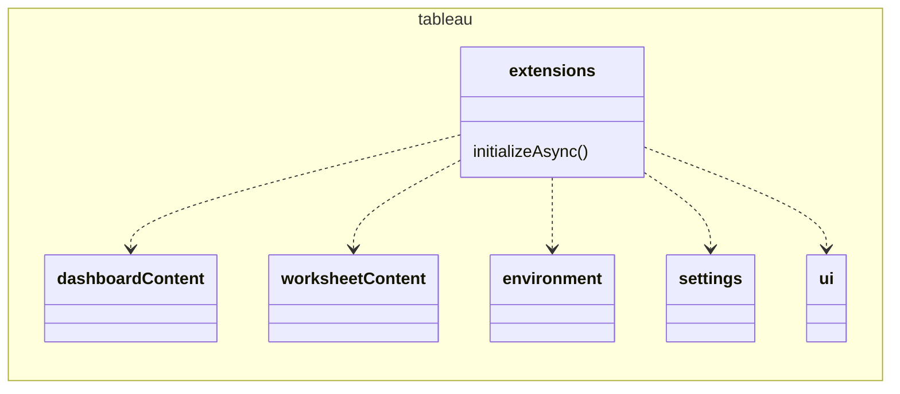
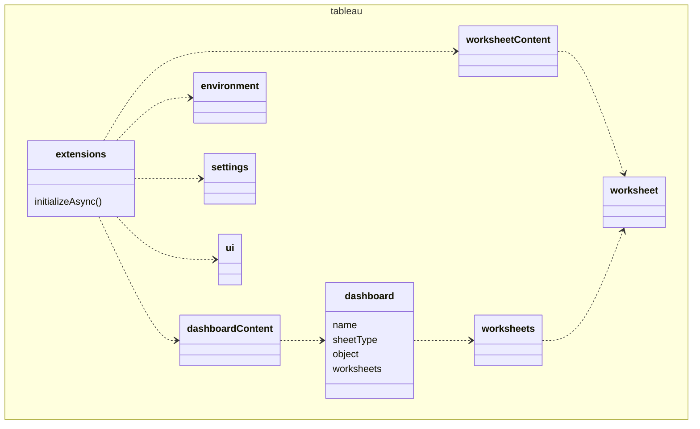

---
title: Tableau Extensions API Basics
description: Overview of the API
--- 

The Tableau Extensions API is organized by namespaces. The type of extension you create determines the set of namespaces the extension will have access to.


| Extension | Description|
| ----- | ------- |
| Dashboard extensions | For example, if you create and register a dashboard extension, the extension will have access to the `dashboardContent` namespace, which provides access to the dashboard object. When you have the dashboard object, you have access to all elements in the dashboard, including the worksheets, marks, filters, parameters, and data sources. |
| Viz extensions | If you create and register a viz extension, the extension will have access to the `worksheetContent` namespace, which provides access to the worksheet object. When you have the worksheet object, you have access to all elements in the worksheet, including the marks, filters, parameters, and data sources.|

## Navigating the top-level `tableau` and `extensions` namespaces

The [Extensions API Reference](pathname:///api) namespaces are like containers that comprise the classes and methods for communicating with Tableau components. At the highest-level, is the `tableau` namespace, which has no constructs, but contains the `extensions` namespace. The `tableau` namespace serves primarily as the overall container and keeps the global namespace clean.

The `extensions` namespace is the namespace for Tableau extensions. A dashboard extension is one type of extension. When a extension is registered as a dashboard extension, it has access to the `dashboardContent` namespace, and all of the objects and classes of the dashboard.

A viz extension is another type of extension. When a extension is registered as a viz extension, it has access to the `worksheetContent` namespace, and all of the objects and classes of the worksheet. A viz extension does not have access to the `dashboardContent`.

The type of extension you have registered determines what namespaces will be available. Some namespaces, like the `settings`, `environment`, and `ui` are available to all extensions.  

The `extensions` namespace has one method `initializeAsync()` that is used to initialize the extension. When this method is called, it also triggers Tableau to configure the Extensions API. Like the Tableau JavaScript API, the Extensions API follows the [CommonJS Promises/A standard](http://wiki.commonjs.org/wiki/Promises/A) for asynchronous method calls.

<!--  -->



## Registering and accessing dashboard extensions

The dashboard extension is one type of extension in the Tableau extensions namespace (and it is accessed using `tableau.extensions`). To register the extension, you declare the type of extension in the manifest file (`.trex`). For more information about what goes in the file, see [Tableau Manifest File](./dashext/trex_manifest).

```xml
<dashboard-extension id="com.example.extensions.name" extension-version="0.1.0">

```

After the extension is initialized, it provides access to the objects in the dashboard, but also has access to the namespaces that are common to all extensions. For example, you can use the `tableau.extensions.environment` to query the environment the dashboard is running in, or `tableau.extensions.settings` to set or get key-value pairs associated with the extension. The `tableau.extensions.settings` can be saved with the workbook, so you can configure the dashboard and the extension in specific ways and then share that configuration with others. 

To access the objects in the dashboard, you specify the namespace reserved for dashboard extensions `dashboardContent`, which then gives you access to the dashboard object. For example, the following code snippet gets the array of worksheets in the dashboard.

```javascript

window.onload = tableau.extensions.initializeAsync().then(async () => {
  // Get the array of worksheets in the dashboard
  const worksheets = tableau.extensions.dashboardContent.dashboard.worksheets;

// ...
});

```


<!-- The following diagram shows an outline of the namespace hierarchy that you traverse to get to worksheets. -->

<!--  -->

## Registering and accessing viz extensions

The viz extension is another type of extension in the Tableau extensions namespace (and it is accessed using `tableau.extensions`). To register the viz extension, you specify the extension as a `worksheet-extension` in the manifest file (`.trex`). For more information about what goes in the file, see [Tableau Viz Manifest File](./vizext/trex_viz_manifest).

```xml
<worksheet-extension id="com.example.extensions.name" extension-version="0.1.0">

```

After the viz extension is initialized, it provides access to the objects in the worksheet, but also has access to the namespaces that are common to all extensions. For example, you can use the `tableau.extensions.environment` to query the environment the extension is running in, or `tableau.extensions.settings` to set or get key-value pairs associated with the extension. The `tableau.extensions.settings` can be saved with the workbook, so you can configure the viz extension in specific ways and then share that configuration with others.

To access the properties and methods in the worksheet, you specify the namespace used by viz extensions, `worksheetContent`, which then gives you access to the worksheet object. For example, the following code snippet gets the worksheet in the dashboard.

```javascript

window.onload = tableau.extensions.initializeAsync().then(async () => {
  // Get the worksheet that the Viz Extension is running in
  const worksheet = tableau.extensions.worksheetContent.worksheet;
  // ...

});

```

## Using properties and methods in the `dashboard` and `worksheet` namespace

The Tableau Extensions API is similar to the Tableau Embedding API. The `dashboard` and `worksheet` class or namespace inherit from an abstract `sheet` class. You can use the [Extensions API Reference](pathname:///api/) to find the properties and methods that are available for dashboard and worksheet objects.

For example, after you access a worksheet object, you can use that worksheet to get properties. such as the name or size, or to call methods that get or apply filters, get data, or set or remove event listeners.

The following code fragment shows an example of setting an event listener `addEventListener` on a worksheet.

```javascript
    // Add an event listener for the selection changed event on this sheet.
    // Assigning the event type to a variable just to make the example fit on the page here.
    const markSelection = tableau.TableauEventType.MarkSelectionChanged;
    let unregisterEventHandlerFunction = worksheet.addEventListener( markSelection, myfunctionHandleSelectionEvent);

```

The following diagram shows the `tableau` namespace.




