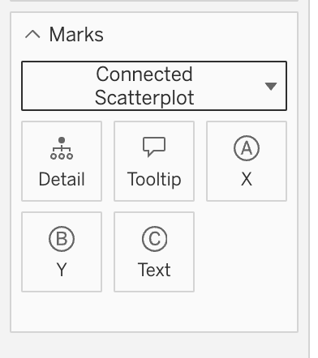

The viz extension manifest file (`.trex`) contains metadata for the extension and is used for registration. The manifest file for viz extensions is similar to the file used for dashboard extensions in structure, but instead of the `dashboard-extension` element, you define a `worksheet-extension` element. The manifest files are not interchangeable.

For details about a manifest or its fields, see the [Sample Manifest File](#sample-viz-manifest-file) and [Elements of the Viz Manifest File](#elements-of-the-viz-manifest-file).  

---

## Manifest Versioning

The versioning of the manifest is designed to be semantically simple and support compatibility. The version follows the [Major].[Minor] format. Minor upgrades are backwards compatible while major upgrades involve breaking changes.

## Error Reporting

At start up, Tableau checks the manifest file. If any errors are found while parsing the file, Tableau writes these errors to the `log.txt` file in the `My Tableau Repository/Logs` folder. This is the same location that Tableau Desktop uses to report other errors and activity.

## Sample Viz Manifest File

```xml
<?xml version="1.0" encoding="utf-8"?>
<manifest manifest-version="0.1" xmlns="http://www.tableau.com/xml/extension_manifest">
  <worksheet-extension id="com.example.extensions.name" extension-version="0.1.0">
    <default-locale>en_US</default-locale>
    <name resource-id="name"/>
    <description>Viz extension description</description>
    <author name="USERNAME" email="USER@example.com" organization="MyCo" website="https://www.example.com"/>
    <min-api-version>1.1</min-api-version>
    <source-location>
      <url>SCHEME:SERVER:PORT/PATH</url>
    </source-location>
    <icon>Base64-Encoded ICON</icon>
    <permissions>
      <permission>full data</permission>
    </permissions>
    <encoding id="Encoding-id">
      <display-name resource-id="encoding-name">Encoding display name</display-name>
      <data-spec>
        <data-type>Encoding-type</data-type>
      </data-spec>
      <role-spec>
        <role-type>Encoding-role</role-type>
      </role-spec>
      <fields max-count="n"/>
      <encoding-icon token="letter-m" />
      <tooltip resource-id="tooltip-id">Default tooltip text for encoding</tooltip>
    </encoding>
  </worksheet-extension>
  <resources>
    <resource id="name">
      <text locale="en_US">name in English</text>
      <text locale="fr_BE">name in French</text>
      <text locale="de_DE">name in German</text>
    </resource>
    <resource id="encoding-name">
      <text locale="en_US">EnglishEncoding</text>
      <text locale="fr_BE">FrenchEncoding</text>
      <text locale="de_DE">GermanEncoding</text>
    </resource>
    <resource id="tooltip-id">
      <text locale="fr_BE">French tooltip text</text>
    </resource>
  </resources>
</manifest>

``````


## Elements of the Viz Manifest File

<table>
<colgroup>
<col width="30%" />
<col width="70%" />
</colgroup>
<thead>
<tr class="header">
<th>Name of element</th>
<th>Description</th>
</tr>
</thead>
<tbody>
<tr class="odd">
<td><code>manifest</code></td>
<td>The root element that contains the manifest options.</td>
</tr>
<tr class="even">
<td><code>manifest-version</code></td>
<td>The version of the manifest. Leave this as version 0.1. </td>
</tr>
<tr class="odd">
<td><code>worksheet-extension</code></td>
<td>The root element that contains the options for the viz extension. The <code>worksheet-extension</code> includes the <code>id</code> attribute, which follows the reverse domain name pattern (<code>com.example.extension</code>), and <code>extension-version</code> number attribute. These attributes are required.</td>
</tr>
<tr class="even">
<td><code>extension-version</code></td>
<td>The version of the your extension. For example, <code>extension-version="0.1.0"</code></td>
</tr>
<tr class="odd">
<td><code>default-locale</code></td>
<td>Specifies the default locale to use for localized text. Here both the locale format (en_US) and language code (en) are accepted. The default locale specified here is converted to one of the supported languages in the Tableau UI. If the language is unsupported or invalid, English is set as default. </td>
</tr>
<tr class="even">
<td><code>name</code></td>
<td>The name of the extension as it appears on the Marks card under <b>Viz Extensions</b>. To provide localized text, specify the name of the resource-id and provide the text strings in the resources element of the manifest (see the manifest example). You can provide localized strings for name and description.</td>
</tr>
<tr class="odd">
<td><code>description</code></td>
<td>A short description of the extension.</td>
</tr>
<tr class="even">
<td><code>author</code></td>
<td>Specifies metadata about the author of the extension, including <code>name</code>, <code>email</code> address, <code>organization</code>, and <code>website</code>. The <code>name</code> and <code>website</code> attributes are required. The <code>website</code> URL must use HTTPS. The <code>website</code> . </td>
</tr>
<tr class="odd">
<td><code>source-location</code></td>
<td>Contains the <code>url</code> of the server that hosts the web page you create that interacts with Tableau.</td>
</tr>
<tr class="even">
<td><code>url</code></td>
<td>Specifies the scheme (HTTPS, HTTTP), the name of the server, the port (optional) and the path to extension (optional). The <code>url</code> must use HTTPS. For example: <code>https://example.com/extension</code>. 
The exception is for <code>localhost</code>. In this case, HTTP is allowed. For example: <code>http://localhost:8080</code>.</td>
</tr>
<tr class="even">
<td><code>icon</code></td>
<td>Not currently used. The icon is a 70x70 pixel PNG file that is Base64 encoded. If you need an encoder, see <a href="https://www.base64-image.de/" class="uri">https://www.base64-image.de/</a></td>
</tr>
<tr class="odd">
<td><code>permissions</code></td>
<td>Declares the types of permissions that this extension requires. The only option is <code>full data</code>. If your extension can access the underlying data or information about the data sources, you must declare full data permission in the manifest. Full data permissions are required if you use any one of the following APIs: <code>Worksheet.getUnderlyingDataAsync()</code>, <code>Worksheet.getUnderlyingTablesAsync()</code>, <code>Worksheet.getUnderlyingTableDataAsync()</code>, <code>Worksheet.getUnderlyingTableDataReaderAsync()</code>, <code>Datasource.getLogicalTables()</code>, <code>Datasource.getLogicalTableData()</code>, <code>Datasource.getUnderlyingDataAsync()</code>, <code>Datasource.getActiveTablesAsync()</code>, <code>Datasource.getConnectionSummariesAsync()</code>. If your extension does not use one of these APIs, you do not need include permissions element. For more information, see <a href="./trex_data_access.html">Accessing Underlying Data</a>.</td>
</tr>
<tr class="even">
<td><code>encoding</code></td>
<td>Adds tiles to the Marks card for encoding. This is an optional element. By default, the Detail and Tooltip tiles appear on the Marks card. You can use the encoding element to add additional tiles for the fields you want to encode. See the <a href="#add-encoding-in-the-viz-manifest">Encoding</a> section for more information.</td>
</tr>
<tr class="odd">
<td><code>resources</code></td>
<td>Specifies the resources that can be localized.</td>
</tr>
<tr class="even">
<td><code>min-api-version</code></td>
<td>Specifies the minimum API version required to run the extension. </td>
</tr>
</tbody>
</table>

**Constraints** 

- String-based fields: 1000 characters
- URI-based fields: 2084 characters
- Icon field: size of images are restricted to 70x70

----

## Add encoding in the viz manifest

By default, the viz extension has access to the Detail and Tooltip tiles on the Marks card. You can specify additional encoding tiles for the fields you use in your viz extension by adding `<encoding>` elements. Adding encoding elements is optional.

To add custom encoding, you provide definitions for the encoding in the manifest file. For example, the following XML code defines three encoding tiles: an X and Y encoding for continuous numeric measures, and a text encoding for string values. The value of attribute named `id` inside the `<encoding>` element can be used to map to a variable in your JavaScript code. That code then generates the visualization based upon your data.

```xml

<encoding id="x">
  <display-name>X</display-name>
  <data-spec>
    <data-type>numeric</data-type>
  </data-spec>
  <role-spec>
    <role-type>continuous-measure</role-type>
  </role-spec>
  <fields max-count="1"/>
  <tooltip resource-id="tooltip-x-id">Default tooltip text for X encoding</tooltip>
  <encoding-icon token="letter-x" />
</encoding>
<encoding id="y">
  <display-name>Y</display-name>
  <data-spec>
    <data-type>numeric</data-type>
  </data-spec>
  <role-spec>
    <role-type>continuous-measure</role-type>
  </role-spec>
  <fields max-count="1"/>
  <encoding-icon token="letter-y" />
  <tooltip resource-id="tooltip-y-id">Default tooltip text for Y encoding</tooltip>
</encoding>
<encoding id="text">
  <display-name>Text</display-name>
  <data-spec>
    <data-type>string</data-type>
  </data-spec>
  <encoding-icon token="text" />
  <tooltip>Only tooltip text for TEXT encoding</tooltip>
</encoding>

``````

These encodings are rendered on the Marks card as tiles, with the X, Y and Text icons.



:::note

The Tooltip and Details tiles encoding are always part of a viz extension.

:::

The following table lists the elements and values you can use to add encoding tiles to the Marks card.

<table>
<colgroup>
<col width="30%" />
<col width="70%" />
</colgroup>
<thead>
<tr class="header">
<th>Name of element</th>
<th>Description</th>
</tr>
</thead>
<tbody>
<tr class="odd">
<td><code>encoding</code></td>
<td>(Optional) The element that contains the encoding definition. By default, all viz extensions will have the Tooltip and Details encoding tiles. If you want to add your own encoding tile, add this &lt;encoding&gt; element to the manifest file and specify a unique <code>id</code> for the encoding. The <code>id</code> corresponds to a variable in your code that is used to generate the visualization from the data. For example, the encoding with the <code>id</code> of <code>'x'</code> could be used to map fields to the x-axis of the visualization. You can add up to four custom encodings. </td>
</tr>
<tr class="even">
<td><code>display-name</code></td>
<td>(Required) The text string to display on the encoding tile on the Marks card. You can localize this text string by adding an optional <code>resource-id</code> for the encoding. For example, <code>&lt;display-name resource-id="encoding1"&gt;Encoding Name&lt;display-name&gt;</code>. You provide localized strings for this <code>resource-id</code> in the <code>resources</code> section of the manifest file.</td>
</tr>
<tr class="odd">
<td><code>data-spec</code></td>
<td>(Optional) Includes the list of data types supported by this encoding. If a &lt;data-spec&gt; element is included, only fields of the specified data types are accepted for this encoding. If the <code>data-spec</code> attribute is omitted, all supported data types will be accepted. The supported data types are defined in this table.</td>
</tr>
<tr class="even">
<td><code>data-type</code></td>
<td>There are four possible data types. <br/><code>numeric</code>, which supports integer and decimal numeric fields. <br/><code>temporal</code>, which supports the three temporal related fields, date, time, and date/time. <br/> <code>string</code>, any text string field. <br/> <code>boolean</code>, which supports a boolean (true/false) field. <br/>Geographic and cluster group data types are not supported. For more information, see <a href="https://help.tableau.com/current/pro/desktop/en-us/datafields_typesandroles_datatypes.htm">Data Types</a> in Tableau.</td>
</tr>
<tr class="odd">
<td><code>role-spec</code></td>
<td>(Optional) Includes the list of role types supported by this encoding. Role types correspond to the dimensions and measures in Tableau (indicated by the blue and green pills you place on the visualization). If omitted, all four possible values are supported. For more information, see <a href="https://help.tableau.com/current/pro/desktop/en-us/datafields_typesandroles.htm">Dimensions and Measures, Blue and Green</a>. </td>
</tr>
<tr class="even">
<td><code>role-type</code></td>
<td>(Required) Specifies whether the encoding is for a continuous or discrete dimension or measure. The options are:  <code>continuous-measure</code>, <code>discrete-dimension</code>, <code>continuous-dimension</code>, <code>discrete-measure</code>.</td>
</tr> 
<tr class="odd">
<td><code>fields</code></td>
<td>(Optional) The maximum number of fields that can use this encoding. Use the `max-count` attribute to specify the maximum number of fields. If not specified, there is no limit on the number of fields that can use this encoding.</td>
</tr>
<tr class="even">
<td><code>encoding-icon</code></td>
<td>(Optional) Specify the icon to use in the Encoding tile and next to fields when associated to your encoding. Select from one of the many predefined icons which Tableau offers to Viz Extension developers. If none is specified, the next available default icon which hasn't been used yet will be associated with your encoding. The defaults are the Ⓐ, Ⓑ, Ⓒ, or Ⓓ icons.</td>
</tr>
<tr class="odd">
<td><code>tooltip</code></td>
<td>(Optional) The text string to display as a tooltip when the mouse is hovering over this particular encoding tile. You can localize this tooltip text by adding an optional <code>resource-id</code>.  You provide localized strings for this <code>resource-id</code> in the <code>resources</code> section of the manifest file. With no <code>resource-id</code> xml attribute, the value will be used as the tooltip in all locales.</td>
</tr>
</tbody>
</table>

## Icons

Custom encodings can be assigned a specific icon by using the <code>&lt;encoding-icon&gt;</code> XML tag inside each <code>&lt;extension&gt;</code> entry in the `.trex` manifest file.

```xml

<encoding-icon token="letter-x" />

```

import MarkColorIconSvg from '../assets/icons/MarkColorIcon_16px.svg';
import LetterAIconSvg from '../assets/icons/LetterAIcon_16px.svg';
import MarkSizeBaseIconSvg from '../assets/icons/MarkSizeBaseIcon_16px.svg';
import LetterBIconSvg from '../assets/icons/LetterBIcon_16px.svg';
import LabelsShowIconSvg from '../assets/icons/LabelsShowIcon_16px.svg';
import LetterCIconSvg from '../assets/icons/LetterCIcon_16px.svg';
import MarkLineTypeIconSvg from '../assets/icons/MarkLineTypeIcon_16px.svg';
import LetterDIconSvg from '../assets/icons/LetterDIcon_16px.svg';
import MarkShapeBaseIconSvg from '../assets/icons/MarkShapeBaseIcon_16px.svg';
import LetterEIconSvg from '../assets/icons/LetterEIcon_16px.svg';
import MarkAngleBaseIconSvg from '../assets/icons/MarkAngleBaseIcon_16px.svg';
import DetailBaseIconSvg from '../assets/icons/DetailBaseIcon_16px.svg';
import LetterZIconSvg from '../assets/icons/LetterZIcon_16px.svg';
import SpeechBubbleBaseIconSvg from '../assets/icons/SpeechBubbleBaseIcon_16px.svg';
import MarkLevelIconSvg from '../assets/icons/MarkLevelIcon_16px.svg';
import Digit0IconSvg from '../assets/icons/Digit0Icon_16px.svg';
import MarkLevelRadialIconSvg from '../assets/icons/MarkLevelRadialIcon_16px.svg';
import Digit1IconSvg from '../assets/icons/Digit1Icon_16px.svg';
import MarkEdgeIconSvg from '../assets/icons/MarkEdgeIcon_16px.svg';
import Digit2IconSvg from '../assets/icons/Digit2Icon_16px.svg';
import Digit3IconSvg from '../assets/icons/Digit3Icon_16px.svg';
import DotIconSvg from '../assets/icons/DotIcon_16px.svg';
import Digit4IconSvg from '../assets/icons/Digit4Icon_16px.svg';
import FavoriteOutlineIconSvg from '../assets/icons/FavoriteOutlineIcon_16px.svg';
import Digit5IconSvg from '../assets/icons/Digit5Icon_16px.svg';
import FilterBaseIconSvg from '../assets/icons/FilterBaseIcon_16px.svg';
import Digit6IconSvg from '../assets/icons/Digit6Icon_16px.svg';
import FlowBaseIconSvg from '../assets/icons/FlowBaseIcon_16px.svg';
import Digit7IconSvg from '../assets/icons/Digit7Icon_16px.svg';
import ForecastBaseIconSvg from '../assets/icons/ForecastBaseIcon_16px.svg';
import Digit8IconSvg from '../assets/icons/Digit8Icon_16px.svg';
import GlobeBaseIconSvg from '../assets/icons/GlobeBaseIcon_16px.svg';
import Digit9IconSvg from '../assets/icons/Digit9Icon_16px.svg';
import GridShowIconSvg from '../assets/icons/GridShowIcon_16px.svg';
import HighlightOnIconSvg from '../assets/icons/HighlightOnIcon_16px.svg';
import NumberBaseIconSvg from '../assets/icons/NumberBaseIcon_16px.svg';
import ImageBaseIconSvg from '../assets/icons/ImageBaseIcon_16px.svg';
import CurrencyBaseIconSvg from '../assets/icons/CurrencyBaseIcon_16px.svg';
import JoinBaseIconSvg from '../assets/icons/JoinBaseIcon_16px.svg';
import NumberPercentIconSvg from '../assets/icons/NumberPercentIcon_16px.svg';
import LinkDiagonalIconSvg from '../assets/icons/LinkDiagonalIcon_16px.svg';
import AmpersandIconSvg from '../assets/icons/AmpersandIcon_16px.svg';
import MetricBaseIconSvg from '../assets/icons/MetricBaseIcon_16px.svg';
import NotificationInfoOutlineIconSvg from '../assets/icons/NotificationInfoOutlineIcon_16px.svg';
import MetricDeltaOutlineDownIconSvg from '../assets/icons/MetricDeltaOutlineDownIcon_16px.svg';
import LessThanIconSvg from '../assets/icons/LessThanIcon_16px.svg';
import MetricDeltaOutlineUpIconSvg from '../assets/icons/MetricDeltaOutlineUpIcon_16px.svg';
import EqualIconSvg from '../assets/icons/EqualIcon_16px.svg';
import MoreDotsIconSvg from '../assets/icons/MoreDotsIcon_16px.svg';
import GreaterThanIconSvg from '../assets/icons/GreaterThanIcon_16px.svg';
import NavigationArrowDownIconSvg from '../assets/icons/NavigationArrowDownIcon_16px.svg';
import UnknownBaseIconSvg from '../assets/icons/UnknownBaseIcon_16px.svg';
import NavigationArrowUpIconSvg from '../assets/icons/NavigationArrowUpIcon_16px.svg';
import AtIconSvg from '../assets/icons/AtIcon_16px.svg';
import NavigationArrowLeftIconSvg from '../assets/icons/NavigationArrowLeftIcon_16px.svg';
import FunctionBaseIconSvg from '../assets/icons/FunctionBaseIcon_16px.svg';
import NavigationArrowRightIconSvg from '../assets/icons/NavigationArrowRightIcon_16px.svg';
import ThumbnailEvenIconSvg from '../assets/icons/ThumbnailEvenIcon_16px.svg';


The following table shows the list of icons you can use.

<table>
<colgroup>
<col width="30%" />
<col width="10%" />
<col width="%20" />
<col width="30%" />
<col width="10%" />
</colgroup>
<thead>
<tr class="header">
<th>keyword</th>
<th>Icon</th>
<th>&nbsp;</th>
<th>keyword</th>
<th>Icon</th>
</tr>
</thead>
<tbody>
<tr class="odd">
<td>color</td>
<td><MarkColorIconSvg alt="color primitive"/></td>
<td>&nbsp;</td>
<td>letter-a</td>
<td><LetterAIconSvg alt="letter A"/></td>
</tr>
<tr class="odd">
<td>size</td>
<td><MarkSizeBaseIconSvg alt="size primitive"/></td>
<td>&nbsp;</td>
<td>letter-b</td>
<td><LetterBIconSvg alt="letter b"/></td>
</tr>
<tr class="odd">
<td>text</td>
<td><LabelsShowIconSvg alt="text primitive"/></td>
<td>&nbsp;</td>
<td>letter-c</td>
<td><LetterCIconSvg alt="letter c"/></td>
</tr>
<tr class="odd">
<td>line</td>
<td><MarkLineTypeIconSvg alt="line primitive"/></td>
<td>&nbsp;</td>
<td>letter-d</td>
<td><LetterDIconSvg alt="letter d"/></td>
</tr>
<tr class="odd">
<td>shape</td>
<td><MarkShapeBaseIconSvg alt="shape primitive"/></td>
<td>&nbsp;</td>
<td>letter-e</td>
<td><LetterEIconSvg alt="letter e"/></td>
</tr>
<tr class="odd">
<td>angle</td>
<td><MarkAngleBaseIconSvg alt="angle primitive"/></td>
<td>&nbsp;</td>
<td>...</td>
<td>..</td>
</tr>
<tr class="odd">
<td>detail</td>
<td><DetailBaseIconSvg alt="detail primitive"/></td>
<td>&nbsp;</td>
<td>letter-z</td>
<td><LetterZIconSvg alt="letter z"/></td>
</tr>
<tr class="odd">
<td>tooltip</td>
<td><SpeechBubbleBaseIconSvg alt="tooltip primitive"/></td>
<td>&nbsp;</td>
</tr>
<tr class="odd">
<td>level</td>
<td><MarkLevelIconSvg alt="level primitive"/></td>
<td>&nbsp;</td>
<td>digit-0</td>
<td><Digit0IconSvg alt="digit 0"/></td>
</tr>
<tr class="odd">
<td>level-radial</td>
<td><MarkLevelRadialIconSvg alt="level (radial) primitive"/></td>
<td>&nbsp;</td>
<td>digit-1</td>
<td><Digit1IconSvg alt="digit 1"/></td>
</tr>
<tr class="odd">
<td>edge</td>
<td><iMarkEdgeIconSvg alt="edge primitive"/></td>
<td>&nbsp;</td>
<td>digit-2</td>
<td><Digit2IconSvg alt="digit 2"/></td>
</tr>
<tr>
<td>&nbsp;</td>
<td>&nbsp;</td>
<td>&nbsp;</td>
<td>digit-3</td>
<td><Digit3IconSvg alt="digit 3"/></td>
</tr>
<tr>
<td>dot</td>
<td><DotIconSvg alt="dot"/></td>
<td>&nbsp;</td>
<td>digit-4</td>
<td><Digit4IconSvg alt="digit 4"/></td>
</tr>
<tr>
<td>favorite</td>
<td><FavoriteOutlineIconSvg alt="favorite"/></td>
<td>&nbsp;</td>
<td>digit-5</td>
<td><Digit5IconSvg alt="digit 5"/></td>
</tr>
<tr>
<td>filter</td>
<td><FilterBaseIconSvg alt="filter"/></td>
<td>&nbsp;</td>
<td>digit-6</td>
<td><Digit6IconSvg alt="digit 6"/></td>
</tr>
<tr>
<td>flow</td>
<td><FlowBaseIconSvg alt="flow"/></td>
<td>&nbsp;</td>
<td>digit-7</td>
<td><Digit7IconSvg alt="digit 7"/></td>
</tr>
<tr>
<td>forecast</td>
<td><ForecastBaseIconSvg alt="forecast"/></td>
<td>&nbsp;</td>
<td>digit-8</td>
<td><Digit8IconSvg alt="digit 8"/></td>
</tr>
<tr>
<td>globe</td>
<td><GlobeBaseIconSvg alt="globe"/></td>
<td>&nbsp;</td>
<td>digit-9</td>
<td><Digit9IconSvg alt="digit 9"/></td>
</tr>
<tr>
<td>grid</td>
<td><GridShowIconSvg alt="grid"/></td>
<td>&nbsp;</td>
<td>&nbsp;</td>
<td>&nbsp;</td>
</tr>
<tr>
<td>highlight</td>
<td><HighlightOnIconSvg alt="highlight"/></td>
<td>&nbsp;</td>
<td>hash</td>
<td><NumberBaseIconSvg alt="hash symbol"/></td>
</tr>
<tr>
<td>image</td>
<td><ImageBaseIconSvg alt="image"/></td>
<td>&nbsp;</td>
<td>dollar</td>
<td><CurrencyBaseIconSvg alt="dollar sign"/></td>
</tr>
<tr>
<td>join</td>
<td><JoinBaseIconSvg alt="join"/></td>
<td>&nbsp;</td>
<td>percentage</td>
<td><NumberPercentIconSvg alt="percentage"/></td>
</tr>
<tr>
<td>link</td>
<td><LinkDiagonalIconSvg alt="link"/></td>
<td>&nbsp;</td>
<td>ampersand</td>
<td><AmpersandIconSvg alt="ampersand"/></td>
</tr>
<tr>
<td>metric</td>
<td><MetricBaseIconSvg alt="metric"/></td>
<td>&nbsp;</td>
<td>exclamation</td>
<td><NotificationInfoOutlineIconSvg alt="exclamation mark"/></td>
</tr>
<tr>
<td>delta-down</td>
<td><MetricDeltaOutlineDownIconSvg alt="delta down"/></td>
<td>&nbsp;</td>
<td>smaller-than</td>
<td><LessThanIconSvg alt="smaller than"/></td>
</tr>
<tr>
<td>delta-up</td>
<td><MetricDeltaOutlineUpIconSvg alt="delta up"/></td>
<td>&nbsp;</td>
<td>equal</td>
<td><EqualIconSvg alt="equal sign"/></td>
</tr>
<tr>
<td>three-dots</td>
<td><MoreDotsIconSvg alt="three dots"/></td>
<td>&nbsp;</td>
<td>larger-than</td>
<td><GreaterThanIconSvg alt="large than"/></td>
</tr>
<tr>
<td>arrow-down</td>
<td><NavigationArrowDownIconSvg alt="down arrow"/></td>
<td>&nbsp;</td>
<td>question</td>
<td><UnknownBaseIconSvg alt="question mark"/></td>
</tr>
<tr>
<td>arrow-up</td>
<td><NavigationArrowUpIconSvg alt="up arrow"/></td>
<td>&nbsp;</td>
<td>at-symbol</td>
<td><AtIconSvg alt="at symbol"/></td>
</tr>
<tr>
<td>arrow-left</td>
<td><NavigationArrowLeftIconSvg alt="left arrow"/></td>
<td>&nbsp;</td>
<td>function</td>
<td><FunctionBaseIconSvg alt="function sign"/></td>
</tr>
<tr>
<td>arrow-right</td>
<td><NavigationArrowRightIconSvg alt="right arrow"/></td>
<td>&nbsp;</td>
<td>&nbsp;</td>
<td>&nbsp;</td>
</tr>
<tr>
<td>thumbnail-even</td>
<td><ThumbnailEvenIconSvg alt="thumbnail even"/></td>
<td>&nbsp;</td>
<td>&nbsp;</td>
<td>&nbsp;</td>
</tr>
</tbody>
</table>
