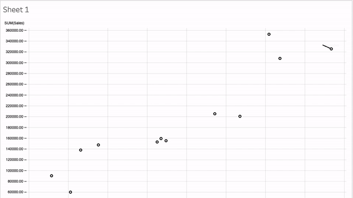

Viz Extensions is a new feature that allows developers to create new viz types that Tableau users can access through the worksheet Marks card. Like Dashboard Extensions, Viz Extensions are web applications that can interact and communicate with Tableau. Developers will be able to build bespoke Viz Extensions that can be made available to Tableau users through the Tableau Extensions API.

---
### Example: a connected scatterplot

   

---

## Components of a Tableau Viz Extension

A Tableau extension consists of a manifest file (`.trex`), a web page (`.html`) that uses a Tableau-provided JavaScript library, and the JavaScript (`.js`) file (or files) that contain your extension logic and code that builds the visualization.

## Why are we building Viz Extensions?

The Tableau Community has many great ideas for new ways to see and understand data. Viz Extensions empowers our community to add to the visualization library directly, enabling our customers to better personalize their experiences in visualizing data.

## How will Viz Extensions be used?

In our New Chart Types pilot program, we tested first-party Viz Extensions such as Sankey and Radial charts, which have been long-requested viz types from our community. We can't wait to see all the different Viz Extensions that will be built that will allow Tableau users to create worksheets tailored to their specific industry and needs.

## How are these different from built-in viz types?

Tableau has a robust viz type library built into our products. They aren't going anywhere. You can still build bar charts, scatter plots, maps, and many more vizzes directly in Tableau. Viz Extensions must be added as an extension to your instance of Tableau before use. Built-in viz types are built by Tableau Developers. Viz Extensions can be built by Tableau Developers or a developer within our community. With built-in viz types, Tableau assigns encoding attributes to marks on the viz. With Viz Extensions, the developer can customize the types of encoding boxes that make sense for their custom viz types. Most, but not all, functionality that works with built-in vizzes will work with Viz Extensions.

## How are Viz Extensions different from Dashboard Extensions?

Dashboard Extensions are custom web applications that you drag directly onto a dashboard, whereas Viz Extensions are loaded in the worksheet. Dashboard Extensions interact with Tableau and provide unique capabilities to your dashboard. Viz Extensions are added to the worksheet while building your viz via the Marks card and enable a more custom visual exploration experience in the flow of work.

While Viz Extensions and Dashboard Extensions share a common library, Viz Extensions have access to the contents of a worksheet (`worksheetContent`) and Dashboard Extensions primarily access the contents of the dashboard (`dashboardContent`).

A few distinctions:

* Viz Extensions will support automatic data updates from the marks card. As users drag and drop new fields in the worksheet, Viz Extensions will update automatically.

* Viz Extensions enable UX customizations on the Marks Card—allowing developers to customize the authoring experience to fit their viz type. Developers can define custom encodings along with the data rules that come with them.

* Viz Extensions provide more options for developers to add to the extension experience by introducing concepts that offer more interactivity, such as selection, Tableau-styles, and tooltips.
 

